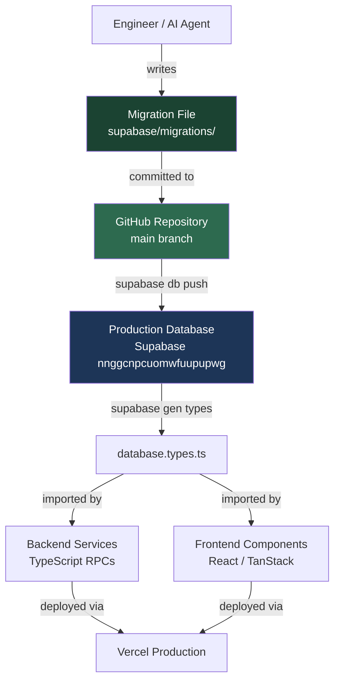
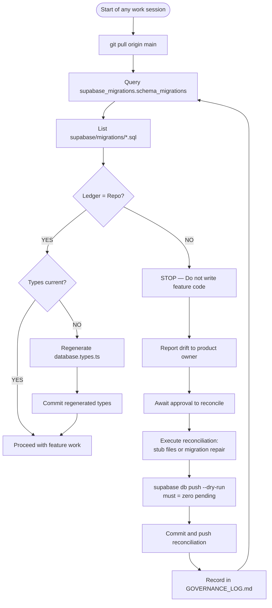
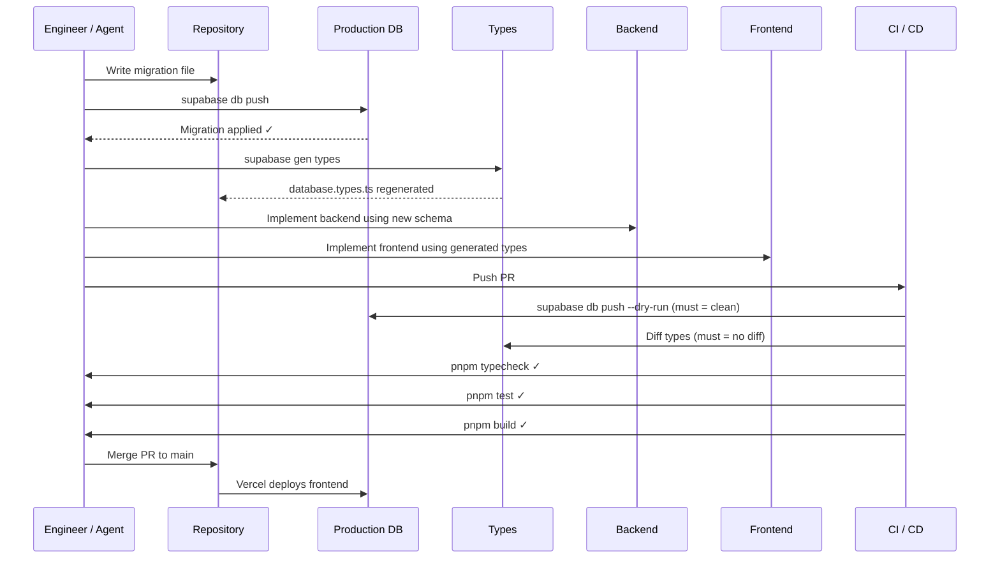
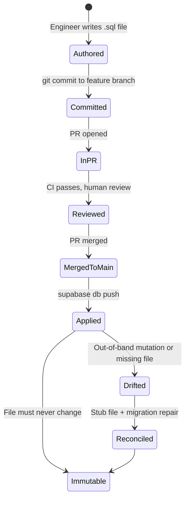

# Rentrix Engineering Governance Policy

> **Status:** MANDATORY — This document defines enforceable engineering policy.
> Deviation requires explicit written approval from the product owner and must
> be recorded in `docs/GOVERNANCE_LOG.md` before the deviation is executed.
>
> **Relationship to `docs/GOVERNANCE.md`:** That file governs the single most
> critical rule (no AI agent mutates production without owner sign-off). This
> document governs everything else: schema, migrations, types, frontend,
> backend, agents, quality gates, and release. Both are in force simultaneously.

---

## Table of Contents

1. [Purpose](#1-purpose)
2. [Scope](#2-scope)
3. [Source of Truth](#3-source-of-truth)
4. [Database Governance](#4-database-governance)
5. [Frontend Governance](#5-frontend-governance)
6. [Development Workflow](#6-development-workflow)
7. [Production Rules](#7-production-rules)
8. [Migration Repair Policy](#8-migration-repair-policy)
9. [Quality Gates](#9-quality-gates)
10. [Pull Request Checklist](#10-pull-request-checklist)
11. [Release Checklist](#11-release-checklist)
12. [Agent Rules](#12-agent-rules)
13. [Repository Protection Rules](#13-repository-protection-rules)
14. [Definition of Done](#14-definition-of-done)
15. [Architecture Principles](#15-architecture-principles)
16. [Practical Examples](#16-practical-examples)
17. [System Diagrams](#17-system-diagrams)
18. [Decision Trees](#18-decision-trees)
19. [Troubleshooting](#19-troubleshooting)

---

## 1. Purpose

This document establishes the mandatory engineering governance policy for the
Rentrix project. Its sole purpose is to permanently prevent **drift** — the
condition where any two of the following diverge from one another:

- The GitHub repository (`supabase/migrations/`)
- The production Supabase database schema
- The generated TypeScript database types (`src/types/database.types.ts`)
- Backend service implementations (RPCs, triggers, functions)
- Frontend UI and API consumers
- The Supabase migration ledger (`supabase_migrations.schema_migrations`)

Drift is the root cause of the majority of production incidents, failed
deployments, type errors, and silent data corruption in this project.
This policy eliminates drift by making synchronisation a hard pre-condition
for every engineering action — not an afterthought.

This is **not** a development guide, a tutorial, or a reference document.
It is a **mandatory policy**. Every engineer, every automated agent, and every
CI/CD pipeline must comply with it at all times.

---

## 2. Scope

This policy applies to:

| Layer | Covered artefacts |
|---|---|
| **Repository** | All files under `supabase/migrations/`, `src/types/database.types.ts`, `docs/`, `.github/workflows/` |
| **Database** | Schema, RPCs, triggers, indexes, constraints, RLS policies, views, functions, enums, sequences |
| **Migration ledger** | `supabase_migrations.schema_migrations` (production) |
| **Backend** | All TypeScript services, API functions, Supabase client calls |
| **Frontend** | All React components, pages, hooks, and API integrations |
| **CI/CD** | All GitHub Actions workflows and Vercel deployment pipelines |
| **AI agents** | Claude and any other automated coding or database agents |
| **Humans** | Every engineer with repository or Supabase dashboard access |

---

## 3. Source of Truth

### 3.1 The GitHub Repository is the Canonical Source

The GitHub repository at `mohamedmasoud3030-tech/rentrixxx` is the **single
source of truth** for the Rentrix system. Every other artefact — the
production database schema, the generated types, the deployed frontend — is a
derived output of what is committed to the repository's `main` branch.

This means:

- If it is not in the repository, it does not officially exist.
- If it exists in production but not in the repository, the repository must
  be updated to reflect it (via a stub migration if already applied, or a
  proper migration if not).
- The production database must always be **fully reproducible** by running
  `supabase db push` from a clean clone of `main`.

### 3.2 Every Schema Change Must Originate from a Versioned Migration

**No schema change may exist in production that does not have a corresponding
committed migration file in `supabase/migrations/`.**

This rule has no exceptions. It applies to:

- Table creation or alteration
- Column additions, removals, or type changes
- Index creation or removal
- Constraint additions or removals
- RLS policy creation, modification, or removal
- Function, trigger, view, or enum creation, replacement, or removal
- Grant or revoke statements
- Extension installation

Even emergency fixes applied directly to production must be reconciled
immediately via a stub migration or a proper migration committed to the
repository and recorded in `docs/GOVERNANCE_LOG.md`.

### 3.3 Production Must Always Be Reproducible from the Repository

The following command sequence, executed against a fresh Supabase project,
must produce a database schema identical to production:

```bash
supabase db push
```

If `supabase db push --dry-run` reports pending migrations, the system is in
a drift state and all feature work must stop until reconciliation is complete.

---

## 4. Database Governance

### 4.1 Migrations

**Rules:**

1. Every migration file must be named `{version}_{descriptive_name}.sql`
   where `{version}` is a 14-digit timestamp (`YYYYMMDDHHmmss`) in UTC.
2. Migration files are **immutable** once committed to `main`. They must never
   be edited, renamed, or deleted.
3. Migration files must be **idempotent where possible** — use `CREATE OR
   REPLACE`, `IF NOT EXISTS`, `ON CONFLICT DO NOTHING`, etc.
4. Each migration must contain exactly the schema changes for one logical unit
   of work. Do not bundle unrelated changes in one migration.
5. Migrations must not depend on application data (no hardcoded IDs, emails,
   or business-specific values — use `SELECT` to resolve references).
6. The `statements` field in `schema_migrations` must accurately reflect what
   the migration does, to aid future reconciliation.

**Forbidden:**

- Editing any committed migration file
- Deleting any migration file
- Running `execute_sql` for DDL operations (bypasses migration ledger)
- Applying DDL through the Supabase dashboard
- Using `supabase migration repair` without recording the repair in
  `docs/GOVERNANCE_LOG.md`

### 4.2 Remote Procedure Calls (RPCs)

1. All business-critical operations (payments, invoice generation, contract
   creation, balance recalculation) must be implemented as atomic PL/pgSQL
   RPCs, not client-side multi-statement sequences.
2. RPCs must be defined in migration files — never created ad hoc.
3. All RPCs must include a role check at entry point
   (`IF auth.role() NOT IN (...) THEN RAISE EXCEPTION`).
4. RPCs that modify financial data must use `SECURITY DEFINER` with explicit
   `search_path = public`.
5. Row-level locking (`SELECT ... FOR UPDATE`) must be used in any RPC that
   reads and then writes the same rows.
6. RPCs must never be called with `execute_sql` in production — only through
   the typed Supabase client (`supabase.rpc()`).

### 4.3 Triggers

1. All triggers must be defined in migration files.
2. Trigger functions must be `SECURITY DEFINER` when they need to bypass RLS
   for balance recalculation or audit logging.
3. Triggers that enforce immutability (e.g., preventing edits to posted journal
   entries) must raise descriptive exceptions, not silent failures.
4. Triggers must never be disabled in production without a corresponding
   migration and governance log entry.

### 4.4 Indexes

1. All indexes must be created in migration files using `CREATE INDEX
   CONCURRENTLY` for large tables to avoid lock contention.
2. Indexes must be named descriptively: `idx_{table}_{columns}`.
3. Unused indexes must be removed via migration, not via dashboard.

### 4.5 Constraints

1. Foreign key constraints must be present for all referential relationships.
2. Check constraints must be used to enforce domain rules (e.g., non-negative
   amounts, valid status enums).
3. Unique constraints must be defined in migrations, not enforced only at the
   application layer.

### 4.6 Row Level Security (RLS)

1. RLS must be enabled on every table that contains tenant data.
2. RLS policies must be defined in migration files.
3. Every new table must have RLS enabled and at least one policy defined in
   the same migration that creates the table.
4. `SELECT` policies must never permit cross-tenant data access.
5. RLS policies must be reviewed in every PR that introduces a new table.

### 4.7 Views

1. Views must be created with `CREATE OR REPLACE VIEW` in migration files.
2. Views that expose aggregated financial data must include the same
   tenant-isolation filters present in the underlying RLS policies.
3. Views must not be used as a substitute for missing RLS on base tables.

### 4.8 Functions and Enums

1. Custom enum types must be defined in migrations. Adding new values to an
   existing enum requires a dedicated migration.
2. Utility functions (non-RPC helpers) must be defined in migrations using
   `CREATE OR REPLACE FUNCTION`.
3. Function signatures must not be changed in place — create a new version
   and deprecate the old one via a subsequent migration.

---

## 5. Frontend Governance

**No UI component, service, hook, API integration, or repository layer may
depend on a schema change that is not already represented by a committed,
applied migration in the production database.**

This means the development order is strict and non-negotiable (see §6).
Frontend work on any feature begins only after:

1. The migration is committed to `main`.
2. The migration is applied to production.
3. TypeScript database types are regenerated and committed.

Specific rules:

1. All database access in the frontend must go through the typed Supabase
   client using the generated types from `src/types/database.types.ts`.
2. No raw SQL strings in the frontend. Use `.from()`, `.rpc()`, and typed
   query builders.
3. No frontend component may reference a table, column, or RPC that does not
   exist in the committed `database.types.ts`.
4. When a migration adds a nullable column, the frontend must handle the
   `null` case explicitly — no implicit assumptions of non-null values.
5. API response shapes must not be manually typed; they must derive from the
   generated database types.

---

## 6. Development Workflow

The following order is **mandatory** for every change that touches the
database schema. Steps must not be reordered, skipped, or parallelised.

```
Schema Design
     │
     ▼
Migration File Created
     │
     ▼
Migration Applied to Production
     │
     ▼
TypeScript Types Regenerated
     │
     ▼
Backend (RPCs / services) Implemented
     │
     ▼
Frontend (components / hooks) Implemented
     │
     ▼
Tests Written and Passing
     │
     ▼
Build Passing (pnpm build)
     │
     ▼
Typecheck Passing (pnpm typecheck)
     │
     ▼
Commit
     │
     ▼
Push → PR → Merge
```

### 6.1 Verification Before Starting Any Work

Before writing a single line of code, verify that the current state of the
system is synchronised:

```bash
# 1. Pull latest main
git pull origin main

# 2. Check for pending migrations (should report none)
supabase db push --dry-run

# 3. Verify types are current
supabase gen types typescript --project-id nnggcnpcuomwfuupupwg \
  > /tmp/current_types.ts
diff /tmp/current_types.ts src/types/database.types.ts

# 4. Run typecheck
pnpm typecheck

# 5. Run tests
pnpm --filter ./rentrix-app run test
```

If any of these steps fails, stop and repair before proceeding (see §8).

### 6.2 Type Regeneration Command

```bash
supabase gen types typescript --project-id nnggcnpcuomwfuupupwg \
  --schema public \
  > rentrix-app/src/types/database.types.ts
```

Type regeneration must be committed in the **same PR** as the migration that
caused the schema change. Types must never lag behind the schema.

---

## 7. Production Rules

### 7.1 Absolute Prohibitions

The following actions are **forbidden** without exception:

| Forbidden Action | Reason |
|---|---|
| Editing schema via Supabase dashboard | Bypasses migration ledger; schema becomes unreproducible |
| Hotfixing production without reconciliation | Creates permanent drift between repo and production |
| Editing committed migration files | Breaks idempotency; invalidates migration history |
| Deleting migration files | Destroys auditability; makes `supabase db push` diverge |
| Deleting rows from `schema_migrations` | Causes spurious re-runs of already-applied migrations |
| Running DDL via `execute_sql` MCP tool | Bypasses migration tracking entirely |
| Applying a migration without committing the file first | Creates production-only schema with no repo counterpart |

### 7.2 Emergency Repair Process

When a production incident requires an immediate schema change:

**Step 1 — Assess**
Determine whether the change can wait for a proper PR (most can, even in
emergencies). If it genuinely cannot:

**Step 2 — Document intent first**
Before touching production, record the intended change in
`docs/GOVERNANCE_LOG.md` with: date, nature of emergency, what will be
applied, and who approved it.

**Step 3 — Write the migration file locally**
Create the migration file in `supabase/migrations/` on a local branch
*before* applying it to production.

**Step 4 — Apply via CLI, not dashboard**
```bash
supabase db push
```
Never apply via the Supabase dashboard SQL editor.

**Step 5 — Commit and push immediately**
The migration file must be in a merged PR within 24 hours of the emergency
application.

**Step 6 — Regenerate types**
Regenerate and commit `database.types.ts` in the same PR.

**Step 7 — Verify reconciliation**
```bash
supabase db push --dry-run  # must report: no pending migrations
```

### 7.3 What Counts as a Production Mutation

Any operation that changes the observable state of the production database:
schema changes, data inserts/updates/deletes, RLS policy changes, function
replacements, grant changes, or migration ledger manipulation.

Read-only introspection (`SELECT`, `information_schema` queries,
`pg_get_functiondef`, `supabase migration list`) is never a mutation.

---

## 8. Migration Repair Policy

### 8.1 When to Use `supabase migration repair`

Use `supabase migration repair --status applied` **only** when a migration was
applied to production out-of-band (e.g., via MCP `apply_migration`) and its
version is not recorded in `schema_migrations`.

Never use `repair` to mark a migration as applied when it has *not* been
applied — this would cause future `db push` runs to skip it silently.

### 8.2 When to Use Stub Migrations

Create a stub migration file (a `.sql` file containing only comments, no
executable SQL) when:

- A schema change was applied to production via a mechanism that did not
  create a repo file (e.g., direct MCP `apply_migration` with a timestamp
  version, ledger repair operations).
- The production ledger contains a version that has no corresponding
  `supabase/migrations/{version}_*.sql` file.
- A migration was registered in the ledger as part of a repair operation and
  that repair migration itself needs a repo file.

Stub file format:

```sql
-- =============================================================================
-- STUB: {descriptive_name}
-- =============================================================================
-- This migration was applied out-of-band to production on {date}.
-- The schema effect is: {describe what was done}.
-- This stub exists solely to synchronise the repository migration history
-- with the production ledger (supabase_migrations.schema_migrations).
--
-- NO EXECUTABLE SQL — history reconciliation only.
-- =============================================================================
```

### 8.3 Ledger Reconciliation Process

When drift is detected between the repository and the production ledger:

1. **Audit the ledger:** Query `supabase_migrations.schema_migrations` for all
   versions. Extract the full list of versions.
2. **Audit the repository:** List all files in `supabase/migrations/`. Extract
   all version prefixes.
3. **Compute the diff:** Identify versions present in the ledger but absent
   from the repo (need stub files), and versions present in the repo but
   absent from the ledger (need `migration repair`).
4. **Resolve repo-missing versions:** Create stub files for each.
5. **Resolve ledger-missing versions:** Run `supabase migration repair
   --status applied` for each (only if the SQL was genuinely applied).
6. **Commit and push all stub files.**
7. **Verify:** Run `supabase db push --dry-run` and confirm zero pending
   migrations.
8. **Record:** Append an entry to `docs/GOVERNANCE_LOG.md`.

### 8.4 What Is Never Acceptable as Repair

- Deleting rows from `schema_migrations`
- Editing the `statements` column of existing ledger rows
- Renaming migration files after they are committed to `main`
- Creating a new migration to "undo" a committed migration instead of
  creating a forward-only correction migration

---

## 9. Quality Gates

Every pull request targeting `main` must pass all of the following gates
before merge is permitted. These are not suggestions — a PR that fails any
gate must not be merged.

| Gate | Command | Must Result In |
|---|---|---|
| No pending migrations | `supabase db push --dry-run` | Zero pending |
| No migration drift | Ledger vs. repo diff | Zero mismatches |
| Types current | `diff` generated vs. committed | Zero diff |
| Typecheck | `pnpm typecheck` | Zero errors |
| Unit + integration tests | `pnpm --filter ./rentrix-app run test` | All passing |
| Financial suite | `pnpm --filter ./rentrix-app run test:financials` | All passing |
| Production build | `pnpm build` | Zero errors |

CI must enforce all gates automatically. A passing CI run is a necessary but
not sufficient condition for merge — human review of schema changes is also
required.

---

## 10. Pull Request Checklist

Every pull request must include this checklist, completed by the author
before requesting review.

```markdown
## Engineering Governance Checklist

### Schema & Migrations
- [ ] No schema changes were made outside of a versioned migration file
- [ ] All new migration files are named `{YYYYMMDDHHmmss}_{name}.sql`
- [ ] No existing migration files were modified
- [ ] `supabase db push --dry-run` reports zero pending migrations
- [ ] The migration ledger and repository are fully synchronised

### Types
- [ ] `database.types.ts` was regenerated after any schema change
- [ ] The regenerated types are committed in this PR
- [ ] No TypeScript types were manually written to work around missing schema

### Backend
- [ ] All new RPCs include a role check
- [ ] All new RPCs touching financial data use `SECURITY DEFINER`
- [ ] No raw SQL strings exist in the application layer
- [ ] All new tables have RLS enabled with at least one policy

### Frontend
- [ ] No frontend code references columns, tables, or RPCs not yet in production
- [ ] All new UI handles null/undefined cases from nullable columns
- [ ] No API response shapes were manually typed outside of generated types

### Quality Gates
- [ ] `pnpm typecheck` passes with zero errors
- [ ] `pnpm --filter ./rentrix-app run test` passes
- [ ] `pnpm --filter ./rentrix-app run test:financials` passes
- [ ] `pnpm build` completes without errors

### Documentation
- [ ] If a production mutation was made outside of a PR, it is recorded in
      `docs/GOVERNANCE_LOG.md`
- [ ] If any governance rule was deviated from, the deviation is approved and
      recorded
```

---

## 11. Release Checklist

Before every production release (merge to `main` that triggers a Vercel
production deployment):

### Pre-Release

- [ ] All PRs in this release have passed their individual PR checklists
- [ ] `git pull origin main` — working from the latest main
- [ ] `supabase db push --dry-run` — zero pending migrations in production
- [ ] Ledger vs. repo diff — zero mismatches
- [ ] `database.types.ts` matches current production schema exactly
- [ ] All CI checks passing on the release commit

### Database

- [ ] All migrations for this release are applied to production
- [ ] RLS policies verified on all tables touched by this release
- [ ] No indexes missing on foreign key columns introduced in this release
- [ ] Financial RPCs tested against production data (read-only verification)

### Application

- [ ] `pnpm typecheck` passes
- [ ] `pnpm build` produces a clean output
- [ ] Full test suite passes including financial suite
- [ ] Vercel preview deployment reviewed and approved by product owner

### Post-Release

- [ ] Vercel production deployment succeeded (no `sts_credentials_fetch_failed`
      or build errors)
- [ ] `supabase db push --dry-run` still reports zero pending migrations
      after deployment
- [ ] Application smoke test: core flows (login, contract creation, invoice,
      payment) verified in production
- [ ] Any production mutations made during release recorded in
      `docs/GOVERNANCE_LOG.md`

---

## 12. Agent Rules

This section applies to Claude and any other AI coding or database agent
operating on the Rentrix codebase or Supabase project.

### 12.1 Mandatory Pre-Work Checks

Before writing a single line of code or executing any tool call, an agent
must:

1. **Pull the latest `main`** — never operate on a stale clone.
2. **Check for migration drift** — query `supabase_migrations.schema_migrations`
   and compare against `supabase/migrations/` file listing.
3. **Check for pending migrations** — conceptually equivalent to
   `supabase db push --dry-run`.
4. **Verify types are current** — compare the production schema against the
   committed `database.types.ts`.

If any of these checks reveals drift, the agent must **stop immediately**,
report the drift to the product owner, and repair synchronisation before
implementing any feature work.

### 12.2 Mandatory Prohibitions for Agents

| Prohibited Action | No Exception |
|---|---|
| Applying DDL to production via `execute_sql` | Never. Use `apply_migration`. |
| Applying any production mutation without product owner sign-off | Never. See `docs/GOVERNANCE.md`. |
| Editing committed migration files | Never. |
| Deleting migration files or ledger rows | Never. |
| Creating new features while drift exists | Never. Stop and repair first. |
| Rewriting migration history to resolve conflicts | Never. Use stub files. |
| Bypassing quality gates to merge faster | Never. |

### 12.3 Agent Drift Response Protocol

```
Drift detected?
     │
     YES
     │
     ▼
Stop all feature work immediately
     │
     ▼
Report drift to product owner:
- Which versions are in ledger but not in repo?
- Which versions are in repo but not in ledger?
- What is the root cause?
     │
     ▼
Await explicit approval to proceed with reconciliation
     │
     ▼
Execute reconciliation (stub files or migration repair)
     │
     ▼
Verify: supabase db push --dry-run = zero pending
     │
     ▼
Commit and push reconciliation
     │
     ▼
Record in docs/GOVERNANCE_LOG.md
     │
     ▼
Resume feature work
```

### 12.4 Agent Memory and Context

Agents must treat the following files as authoritative context at the start
of every session:

- `docs/ENGINEERING_GOVERNANCE.md` (this file)
- `docs/GOVERNANCE.md` (production mutation rule)
- `docs/GOVERNANCE_LOG.md` (history of approved mutations)
- `docs/CURRENT_STATE.md` (current implementation state)
- `docs/NEXT.md` (pending work)

An agent may not rely on its memory of a previous session as evidence that
drift does not exist. Drift must be verified by inspecting live state at the
start of each session.

---

## 13. Repository Protection Rules

### 13.1 Protected Files

The following files must never be deleted, renamed, or substantively modified
without explicit product owner approval recorded in `docs/GOVERNANCE_LOG.md`:

| File / Path | Protection Reason |
|---|---|
| `supabase/migrations/*.sql` | Immutable migration history |
| `docs/GOVERNANCE.md` | Production mutation guard |
| `docs/GOVERNANCE_LOG.md` | Append-only consent trail |
| `docs/ENGINEERING_GOVERNANCE.md` | This policy document |
| `.github/workflows/ci.yml` | Quality gate enforcement |
| `scripts/check-production-mutation-guard.sh` | CI governance check |
| `rentrix-app/src/types/database.types.ts` | Generated types — must track schema |

### 13.2 What "Protected" Means

- **Migration files:** Truly immutable. If a change is needed, create a new
  forward-only migration. Never edit in place.
- **Governance documents:** May be extended or clarified, but the substantive
  rules they contain must not be weakened without product owner sign-off.
- **CI workflows:** Must not be modified to skip or soften quality gates.
- **Generated types:** Must be updated (regenerated) when schema changes, but
  must never be manually edited to paper over schema drift.

### 13.3 Branch Protection

The `main` branch must have the following protections enforced on GitHub:

- Require pull request before merging (no direct pushes)
- Require all CI checks to pass before merge
- Require at least one approval for PRs that touch `supabase/migrations/`,
  `docs/GOVERNANCE*.md`, or `.github/workflows/`
- Do not allow force pushes
- Do not allow branch deletion

---

## 14. Definition of Done

A task, feature, or fix is **not complete** until all of the following are
true simultaneously:

| Layer | Done Condition |
|---|---|
| **Repository** | All code and migration files committed and pushed to `main` |
| **Migrations** | All migrations committed and applied to production; zero pending |
| **Production** | Production schema matches repository exactly (`db push --dry-run` = clean) |
| **Generated Types** | `database.types.ts` regenerated, committed, and matching current schema |
| **Backend** | All RPCs, triggers, and functions implemented, tested, and deployed |
| **Frontend** | All UI components implemented using generated types; no type errors |
| **Tests** | Full test suite passing including financial tests |
| **Build** | Production build clean with zero errors |
| **CI** | All CI checks passing on the merged commit |
| **Documentation** | Any production mutations recorded in `GOVERNANCE_LOG.md` |

Partial completion does not count. A feature branch that has frontend changes
but not yet regenerated types, or a migration that has been applied but not
committed, is **not done**.

---

## 15. Architecture Principles

### 15.1 Schema-First Development

Design the data model before writing any code. The schema is the contract
between the database, the backend, and the frontend. Changes to that contract
propagate in one direction only: from the schema outward.

**Implication:** You cannot write a frontend component for a feature whose
table does not yet exist in a committed migration.

### 15.2 Migration-Driven Development

Every schema change is expressed as a migration. There is no mechanism other
than a committed, versioned migration file for changing the production schema.
This is not a preference — it is the only permitted path.

**Implication:** The Supabase dashboard SQL editor is a read-only inspection
tool for production. Writing DDL there is forbidden.

### 15.3 Repository as Source of Truth

The repository is the ground truth. Production is an output. If they diverge,
the repository definition wins, and production must be brought into alignment
via migrations. Not the reverse.

**Implication:** "It works in production" is not a substitute for having a
migration file.

### 15.4 Idempotent Database Operations

All migrations should be idempotent wherever the database supports it:
`CREATE OR REPLACE`, `IF NOT EXISTS`, `ON CONFLICT DO NOTHING`. This allows
migrations to be re-applied safely in disaster recovery scenarios without
causing errors.

**Implication:** `CREATE TABLE` (without `IF NOT EXISTS`) is acceptable only
for a table guaranteed not to exist. `CREATE OR REPLACE FUNCTION` is always
preferred over `CREATE FUNCTION`.

### 15.5 Immutable Migration History

Once a migration file is committed to `main`, its content is frozen. If the
migration contains an error or needs to change, the correction is a new
forward-only migration. The original file is never touched.

**Implication:** `git log --follow supabase/migrations/` must show a strictly
additive history. No amendments to migration files after initial commit.

---

## 16. Practical Examples

### 16.1 Correct: Adding a New Column

```bash
# Step 1: Create the migration
cat > supabase/migrations/20260720100000_add_notes_to_invoices.sql << 'EOF'
-- Add optional notes field to invoices table
ALTER TABLE invoices ADD COLUMN IF NOT EXISTS notes TEXT;
EOF

# Step 2: Apply to production
supabase db push

# Step 3: Regenerate types
supabase gen types typescript --project-id nnggcnpcuomwfuupupwg \
  > rentrix-app/src/types/database.types.ts

# Step 4: Now write the backend/frontend that uses invoices.notes
# Step 5: Run tests, typecheck, build
# Step 6: Commit everything in one PR
git add supabase/migrations/20260720100000_add_notes_to_invoices.sql
git add rentrix-app/src/types/database.types.ts
git add rentrix-app/src/... # frontend/backend changes
git commit -m "feat(invoices): add notes field"
```

### 16.2 Correct: Emergency Hotfix

```bash
# Production is failing due to a missing index causing timeouts.

# Step 1: Write the migration FIRST, before touching production
cat > supabase/migrations/20260720150000_add_missing_invoices_tenant_idx.sql << 'EOF'
-- Emergency: add missing index on invoices.tenant_id causing query timeouts
CREATE INDEX CONCURRENTLY IF NOT EXISTS idx_invoices_tenant_id
  ON invoices (tenant_id);
EOF

# Step 2: Record in governance log BEFORE applying
echo "2026-07-20 | Emergency | Mohamed | Added idx_invoices_tenant_id | PR#1200" \
  >> docs/GOVERNANCE_LOG.md

# Step 3: Apply via CLI
supabase db push

# Step 4: Commit and push immediately
git add supabase/migrations/20260720150000_add_missing_invoices_tenant_idx.sql
git add docs/GOVERNANCE_LOG.md
git commit -m "fix(db): add missing index on invoices.tenant_id (emergency)"
git push origin main
# PR reviewed and merged within 24 hours
```

### 16.3 Incorrect: What Must Never Happen

```sql
-- ❌ FORBIDDEN: DDL via Supabase dashboard or execute_sql
-- Someone types this directly in the Supabase SQL editor or via MCP execute_sql:
ALTER TABLE invoices ADD COLUMN discount_percentage NUMERIC(5,2) DEFAULT 0;
-- Now production has a column that no migration file describes.
-- The repo cannot reproduce this. Types are stale. Frontend will type-error.
```

```typescript
// ❌ FORBIDDEN: Frontend referencing a column not yet in a migration
const { data } = await supabase
  .from('invoices')
  .select('discount_percentage')  // This column exists in production
                                  // but has no migration file → drift
```

```bash
# ❌ FORBIDDEN: Editing a committed migration
vim supabase/migrations/20260714000002_hardened_invoice_generation.sql
# This breaks idempotency and invalidates migration history.
# Create a new migration instead.
```

### 16.4 Correct: Stub Migration for Out-of-Band Change

```sql
-- supabase/migrations/20260720120000_register_emergency_index.sql
-- =============================================================================
-- STUB: register_emergency_index
-- =============================================================================
-- The index idx_invoices_tenant_id was applied to production on 2026-07-20
-- as an emergency hotfix (see GOVERNANCE_LOG.md 2026-07-20 entry).
-- This stub registers the action in the repository so that:
-- 1. The migration ledger and repository remain synchronised.
-- 2. supabase db push --dry-run reports no pending migrations.
-- 3. Future engineers understand the history.
--
-- NO EXECUTABLE SQL — the index already exists in production.
-- =============================================================================
```

---

## 17. System Diagrams

### 17.1 Source of Truth Flow



### 17.2 Drift Detection and Repair Flow



### 17.3 Development Workflow



### 17.4 Migration Lifecycle



---

## 18. Decision Trees

### 18.1 Should I Apply This Change to Production Now?

```
Is there a migration file committed to main for this change?
├── NO → Write the migration file first. Do not touch production.
└── YES
    └── Has this change been approved by the product owner?
        ├── NO → Await approval. Record in GOVERNANCE_LOG.md when received.
        └── YES
            └── Is the migration ledger and repo fully synchronised?
                ├── NO → Reconcile drift first. Then apply.
                └── YES → Apply via supabase db push. Then commit types.
```

### 18.2 How Do I Handle a Version in the Ledger With No Repo File?

```
Is this version's schema effect visible in production?
├── YES — was this a repair/bookkeeping operation?
│   ├── YES → Create a stub file (comments only, no SQL). Commit and push.
│   └── NO  → Verify what SQL was applied. Create a descriptive stub.
│             Record in GOVERNANCE_LOG.md.
└── NO (version in ledger but no SQL was run) → Investigate before acting.
    This should not happen. Consult product owner.
```

### 18.3 How Do I Handle a Repo File With No Ledger Entry?

```
Has the SQL in this migration file been applied to production?
├── YES → Run: supabase migration repair --status applied --version {version}
│         Record the repair in GOVERNANCE_LOG.md.
└── NO  → Is the change safe to apply now?
    ├── YES → supabase db push. The migration will be applied and registered.
    └── NO  → Mark as problematic. Investigate. Do not apply blindly.
```

### 18.4 Is This Task Done?

```
All 10 conditions below must be TRUE:

  1. Migration file committed to main?                       YES / NO
  2. Migration applied to production (db push dry-run = 0)? YES / NO
  3. Ledger and repo fully synchronised?                     YES / NO
  4. database.types.ts regenerated and committed?            YES / NO
  5. Backend implementation complete and tested?             YES / NO
  6. Frontend implementation complete using generated types? YES / NO
  7. pnpm typecheck passes?                                  YES / NO
  8. pnpm test passes?                                       YES / NO
  9. pnpm build passes?                                      YES / NO
 10. Any production mutations in GOVERNANCE_LOG.md?          YES / NO

If any answer is NO → Task is NOT done.
```

---

## 19. Troubleshooting

### 19.1 `supabase db push` Reports Pending Migrations

**Symptom:** `supabase db push --dry-run` lists one or more migrations as
pending.

**Causes and resolutions:**

| Cause | Resolution |
|---|---|
| A new migration was committed but not yet applied | Run `supabase db push` to apply it |
| A migration was deleted from the repo but its version is in the ledger | Restore the file from git history |
| The ledger has no record of a migration that was applied out-of-band | Run `supabase migration repair --status applied --version {v}` and create a stub file |
| The migration file has a syntax error | Fix the migration (in a new file if already committed), re-apply |

### 19.2 TypeScript Errors After a Schema Change

**Symptom:** `pnpm typecheck` fails after a migration is applied.

**Diagnosis:**
```bash
supabase gen types typescript --project-id nnggcnpcuomwfuupupwg > /tmp/new_types.ts
diff /tmp/new_types.ts rentrix-app/src/types/database.types.ts
```

**Resolutions:**
- If `new_types.ts` differs: types are stale. Regenerate and commit.
- If types are current but code errors remain: the code is referencing a
  column or table that does not exist in the schema. The schema must be
  extended via a new migration, not by editing the type file.

### 19.3 Vercel Deployment Fails with `sts_credentials_fetch_failed`

**Symptom:** Vercel build fails at `build-container-init` with an AWS STS
error.

**Cause:** Transient Vercel/AWS infrastructure failure. Not a code issue.

**Resolution:** Redeploy from the Vercel dashboard. Do not modify any code.
This is not a migration or schema problem.

### 19.4 Migration Applied via MCP Tool Has Wrong Version Timestamp

**Symptom:** A migration applied via `apply_migration` MCP tool is recorded
in the ledger with the execution timestamp as its version (e.g.,
`20260712080434`) rather than the intended semantic version (e.g.,
`20260715000005`).

**Cause:** The MCP `apply_migration` tool uses the current UTC timestamp as
the migration version. If you intend a specific version, use
`supabase db push` from the CLI with the file already committed.

**Resolution:**
1. The ledger entry for the timestamp version already exists — do not delete
   it.
2. Create a stub file for the timestamp version: `20260712080434_{name}.sql`.
3. If the intended semantic version is also in the ledger (registered via
   repair), create a stub for that version too.
4. Both stubs contain comments only — no executable SQL.

### 19.5 An AI Agent Applied DDL via `execute_sql`

**Symptom:** A schema change exists in production with no migration file and
no ledger entry.

**This is a governance violation.** Resolution:

1. Identify exactly what SQL was applied (check agent logs, Supabase audit
   logs, or `information_schema`).
2. Write a proper migration file capturing the applied SQL.
3. Register it in the ledger: `supabase migration repair --status applied
   --version {v}`.
4. Record the violation in `docs/GOVERNANCE_LOG.md` including what agent
   applied it, when, and what was applied.
5. Verify: `supabase db push --dry-run` = zero pending.
6. Review `docs/GOVERNANCE.md` and the agent's instructions to prevent
   recurrence.

### 19.6 A Migration Failed Mid-Execution

**Symptom:** A migration was partially applied — some statements succeeded,
others failed.

**Resolution:**
1. Do not edit the migration file.
2. Query `information_schema` to determine what was actually applied.
3. Write a new forward-only migration that:
   a. Skips the already-applied statements (use `IF NOT EXISTS` guards), or
   b. Applies only what remains.
4. Mark the failed migration as applied in the ledger if its partial effect
   is the desired outcome: `supabase migration repair --status applied`.
5. Apply the correction migration via `supabase db push`.
6. Record in `docs/GOVERNANCE_LOG.md`.

---

## Appendix A: Key File Locations

| Artefact | Path |
|---|---|
| Migration files | `supabase/migrations/*.sql` |
| Generated database types | `rentrix-app/src/types/database.types.ts` |
| Supabase project config | `supabase/config.toml` |
| Governance policy (this file) | `docs/ENGINEERING_GOVERNANCE.md` |
| Production mutation rule | `docs/GOVERNANCE.md` |
| Approved mutations log | `docs/GOVERNANCE_LOG.md` |
| Current implementation state | `docs/CURRENT_STATE.md` |
| Pending work | `docs/NEXT.md` |
| CI workflow | `.github/workflows/ci.yml` |

## Appendix B: Key Commands

```bash
# Check for pending migrations (safe, read-only)
supabase db push --dry-run

# Apply pending migrations to production
supabase db push

# Regenerate TypeScript types from current production schema
supabase gen types typescript --project-id nnggcnpcuomwfuupupwg \
  --schema public > rentrix-app/src/types/database.types.ts

# Register an out-of-band migration as applied
supabase migration repair --status applied --version {version}

# Full quality gate check (run before every PR)
pnpm typecheck && \
pnpm --filter ./rentrix-app run test && \
pnpm --filter ./rentrix-app run test:financials && \
pnpm build
```

## Appendix C: Supabase Project Reference

| Field | Value |
|---|---|
| Project name | RENTRIX EGY |
| Project ID | `nnggcnpcuomwfuupupwg` |
| Region | `ap-southeast-1` |
| Vercel team | `team_HfTz7v2SO3F9cajnRbrnYxUo` |
| GitHub repository | `mohamedmasoud3030-tech/rentrixxx` |

---

*Last updated: 2026-07-12*
*Document owner: Rentrix Engineering*
*Policy status: MANDATORY AND IN FORCE*
