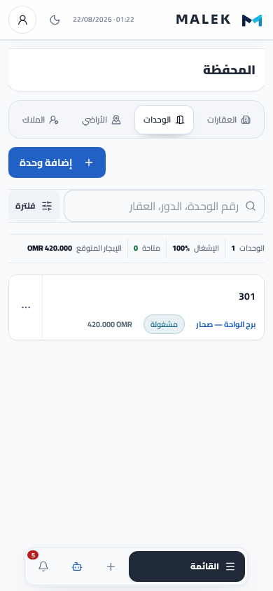
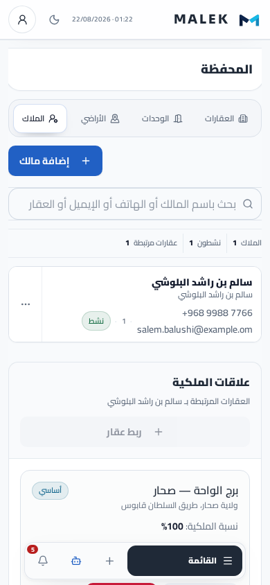
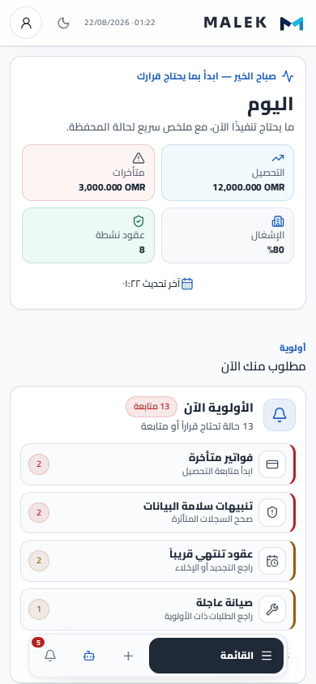
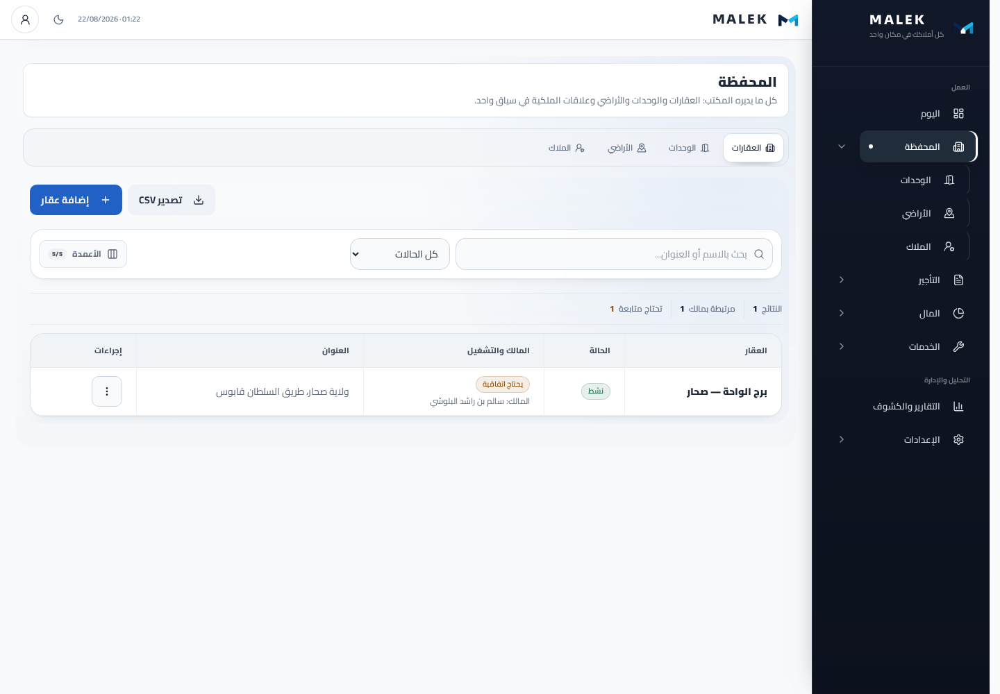
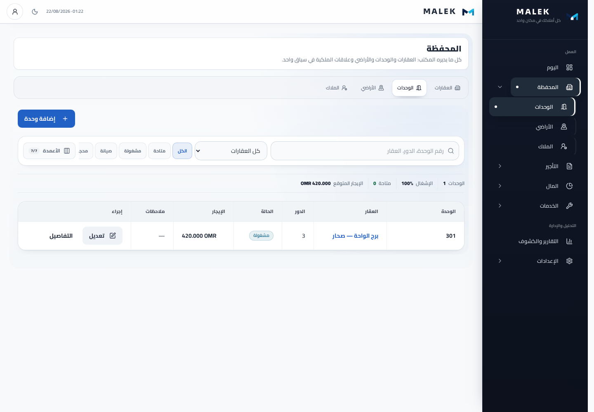
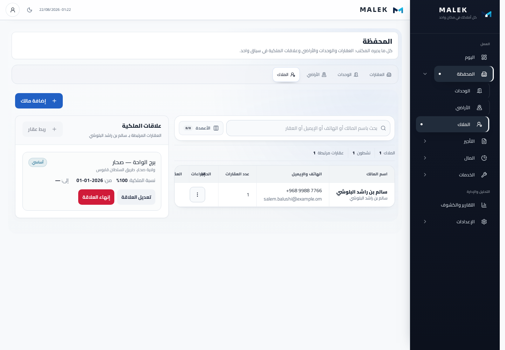
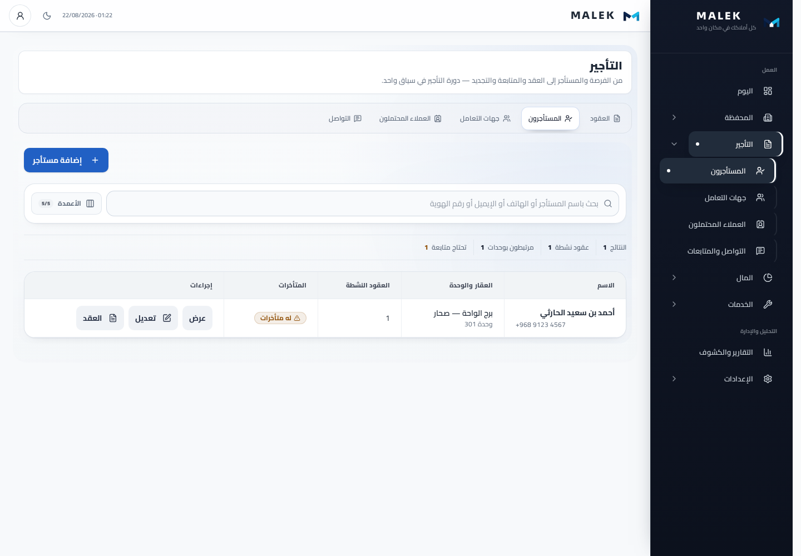
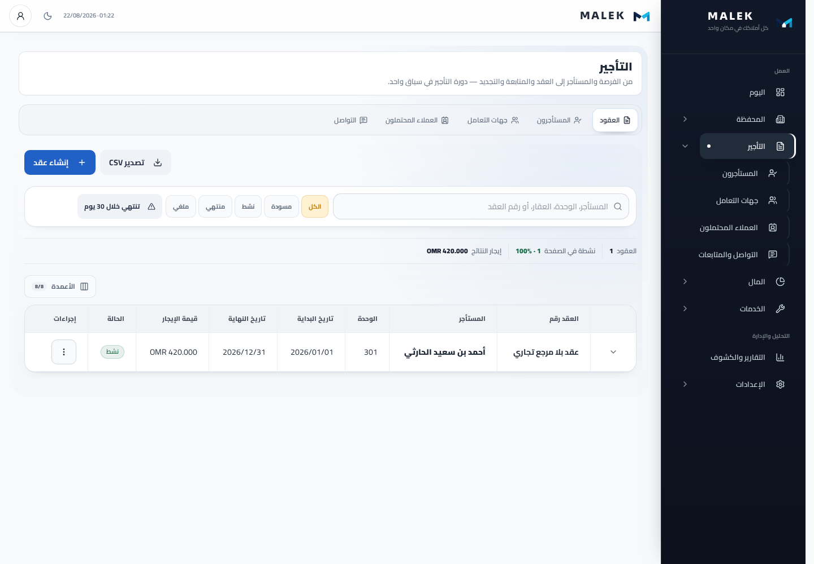
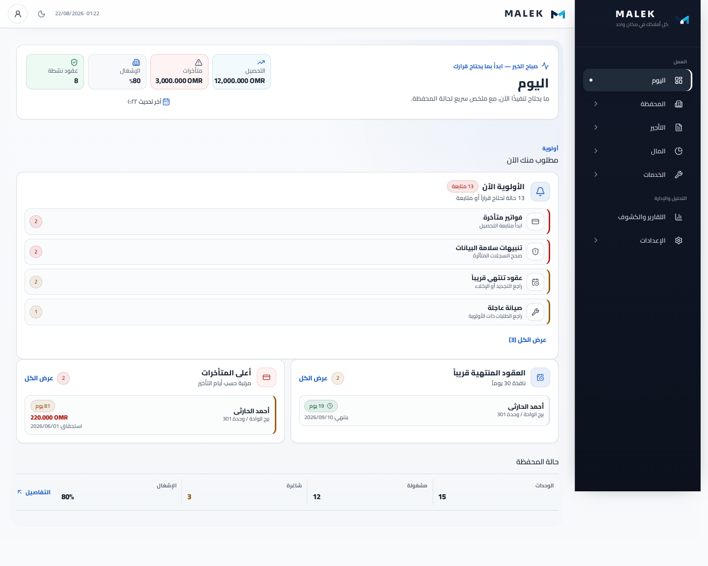

# تقرير القبول المرئي — إعادة ضبط كثافة MALEK على الهاتف

**التاريخ:** 22 أغسطس 2026<br>
**النطاق:** اليوم، العقارات، الوحدات، الملاك، المستأجرون، العقود، ومركز التنقل السفلي<br>
**المقاسات:** iPhone بعرض `390×844`، وسطح مكتب `1440×1000`<br>
**الاتجاه:** العربية / RTL

## منهج الإثبات

- فُتحت مساحات العمل الحقيقية عبر Router وAppShell ومكوّنات الإنتاج المشتركة.
- استُبدلت حدود Supabase HTTP فقط ببيانات حتمية محلية؛ لم تُجرَ أي كتابة على قاعدة بيانات أو بيئة حية.
- شُغّل الفحص على Chromium حقيقي، وليس DOM افتراضيًا.
- تحقّق الاختبار آليًا من عدم وجود overflow أفقي، أو أخطاء Console/Page، أو أسماء سجلات مقصوصة، أو أهداف لمس أساسية أصغر من `44×44`.
- جميع اللقطات أدناه screenshots من المتصفح الفعلي؛ لم تُولّد أي صورة بالذكاء الاصطناعي.

## نتيجة المقارنة مع الملاحظات الأصلية

| المعيار | النتيجة | الدليل |
|---|---|---|
| لا تبدأ صفحات السجلات بكتل KPI ضخمة | ناجح | استُبدلت بملخص دلالي رفيع `EntitySummaryStrip` |
| المسار Tabs → Action → Search/Filters → Data | ناجح | فحص مواضع الـtoolbar والسجل في الصفحات الخمس |
| لا توجد Card داخل Card حول البحث أو الجدول | ناجح | فحص DOM لـregister وعدم وجود Card ancestor |
| الأعمدة لا تشغل الهاتف | ناجح | `DataTableColumnsMenu` مخفي تحت `768px` |
| الفلاتر مفهومة داخل Bottom Sheet | ناجح | العقار / الحالة / الإشغال مسماة، والحالة Chips |
| الصف يعرض أكثر من معلومة مفيدة | ناجح | 1–3 حقائق داعمة تحت هوية السجل |
| لا Pagination لصفحة واحدة | ناجح | لا يوجد landmark باسم «ترقيم الصفحات» في الصفحات الخمس |
| الحالات لا تتضخم بصريًا | ناجح | ارتفاع Badge المرئي ≤ `32px` |
| «اليوم» لا تكرر تقرير التحصيل والمالية | ناجح | لا KPI grid ولا «حالة التحصيل» ثانية |
| الإجراءات السريعة محذوفة من «اليوم» | ناجح | `data-dashboard-action-grid` غير موجود؛ زر `+` العالمي باقٍ |
| «اليوم» شاشة قرارات واستثناءات | ناجح | الترتيب الوحيد: `work-now → portfolio` |
| القائمة ليست Sidebar داخل Sheet | ناجح | صفوف مباشرة، بلا Group cards، وارتفاع ≤ 80% من viewport |
| Desktop لم يتضرر | ناجح | الجداول الدلالية ظاهرة في الصفحات الخمس عند 1440px |
| RTL بلا clipping أو scroll أفقي | ناجح | `scrollWidth <= clientWidth + 1` لكل شاشة وفلاتر وقائمة |
| لا نخدع الكثافة بتصغير اللمس | ناجح | CTA وفلترة وإجراءات وصفوف البيانات الأساسية ≥ `44×44` |

## ما أُزيل

1. بطاقات KPI الكبيرة من العقارات والوحدات والملاك والمستأجرين والعقود.
2. بطاقات «جاهزية التشغيل» و«تغطية الربط» الداكنة الدائمة.
3. رؤوس «سجل …» المتكررة والأوصاف التي كانت تفصل المستخدم عن البيانات.
4. وصف عناوين الأقسام المتكرر من تدفق الهاتف، مع بقائه على سطح المكتب.
5. صف Dropdowns الوحدات الظاهر دائمًا على الهاتف.
6. زر الأعمدة من مساحة الهاتف الأساسية.
7. Pagination عندما `total <= pageSize`.
8. أيقونات الهوية المتكررة بجوار كل اسم سجل.
9. «إجراءات سريعة»، KPI المالية، «حالة التحصيل»، وتحليل الذمم المكرر من «اليوم».
10. بطاقات Groups والمساحات الميتة من مركز التنقل السفلي.

## ما بقي ولماذا

- **زر الإجراء الأساسي:** واضح وبارز لأنه يبدأ المهمة الأساسية في الصفحة.
- **ملخص نصي رفيع:** يحافظ على الأرقام المهمة دون تحويل الصفحة إلى Dashboard.
- **حالة السجل:** Badge صغيرة لأنها معلومة تشغيلية، لا عنصر زخرفي.
- **علاقات الملكية:** بقيت كمساحة عمل فعلية بعد سجل الملاك؛ ليست KPI أو تكرار تنقل.
- **المؤشرات الأربعة أعلى «اليوم»:** بقيت لأنها قراءة أولى سريعة، بينما حُذفت نسخها المكررة أسفل الصفحة.
- **حالة المحفظة:** بقيت كسطر مختصر واحد وفق القرار المطلوب.
- **جداول Desktop:** بقيت للمقارنة الكثيفة، بينما الهاتف يستخدم Data Rows مخصصة.

## لقطات الهاتف — الصفحات الأساسية

### العقارات


### الوحدات



### الملاك



### المستأجرون


### العقود


## لقطات الهاتف — الفلاتر واليوم والقائمة

### فلاتر الوحدات


### اليوم



### مركز التنقل


## لقطات سطح المكتب

| العقارات | الوحدات |
|---|---|
|  |  |

| الملاك | المستأجرون |
|---|---|
|  |  |

| العقود | اليوم |
|---|---|
|  |  |

## لقطات طويلة إضافية

للتدقيق في تدفق الصفحة كاملًا: `properties-iphone-390.png`، `units-iphone-390.png`، `owners-iphone-390.png`، `tenants-iphone-390.png`، `contracts-iphone-390.png`، و`today-iphone-390.png`.

## نتيجة تشغيل القبول المرئي

```text
mobile-density-visual-acceptance.spec.ts
5 passed
- الصفحات الخمس على iPhone
- Bottom Sheet للفلاتر
- Today decisions-first
- مركز التنقل السفلي
- الصفحات الخمس + Today على Desktop
```
